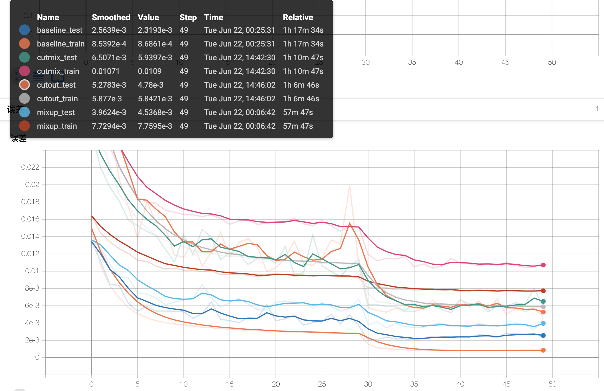

# 深度学习课程 final project --DATA620004 

**小组成员：韩伟东、张泽洋、杨荣键、罗昆**

**学号：20210980105、20210980071、20210980080、2021098089**

This project completed the comparison of the three methods of cutmix, cutout, mixup and the baseline (Resnet) method in the CIFAR-10 image classification task, and tested the performance of the new image detection model.

### Requirement

- Pytorch 1.8.0+cu111
- Python3
- matplotlib   2.2.4
- numpy

#### Weights & Logs

Weights: 放置 **./深度学习课程final_pj/originnet3/weights**  文件夹下

logs 用于tensorboard display 放置 **./深度学习课程final_pj/originnet3/logs** 文件夹下 


### Run model and tensorboard display

The baseline used in this project is the Resnet network, and the design compares 3 methods, namely cutmix, cutout, and mixup. In --methods, you can set ‘cutmix’, ‘cutout’, ‘mixup’

#### training model

```python
python3 run_train_test.py --method 'cutout'
```


#### Accuarcy and Loss 

As follow:
#### ACC


#### Loss:


#### PR-Curve:

